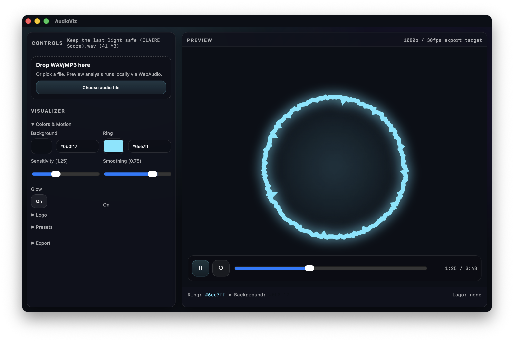

# AudioViz

Local macOS desktop app to turn **WAV/MP3** into simple, YouTube-ready visualizer videos.



## Features
- **Bouncing frequency circle** + **center logo**
- Live preview (WebAudio FFT)
- Export **MP4 1080p / 30fps** locally via **FFmpeg** (bundled in the app)
- Presets saved locally

## Download (recommended)
- Download the latest **`.dmg`** from GitHub Releases: `https://github.com/rkr1209/AudioViz/releases`, open it and drag **AudioViz** into **Applications**.

## Roadmap
- More visualizer styles (bars, radial bars, particles, waveform line)
- Preset management (named presets, import/export, sharing)
- Export options (resolution/fps presets, CPU vs VideoToolbox toggle, quality presets)
- Better timeline controls (scrubbing, markers, loop range)

## Build (macOS)

```bash
npm install
npm run tauri:build:dmg
```

- Output: `src-tauri/target/release/bundle/dmg/`
- The build script will auto-install **Rust** (via rustup) if `cargo` is missing.
- FFmpeg/ffprobe are bundled as **sidecars** automatically for the app build.

## Dev

Web preview only (no export):

```bash
npm install
npm run dev
```

Desktop dev:

```bash
npm install
npm run tauri:dev
```

## Contributing

See `CONTRIBUTING.md`.

## Security

See `SECURITY.md`.

## License

MIT. See `LICENSE`.
